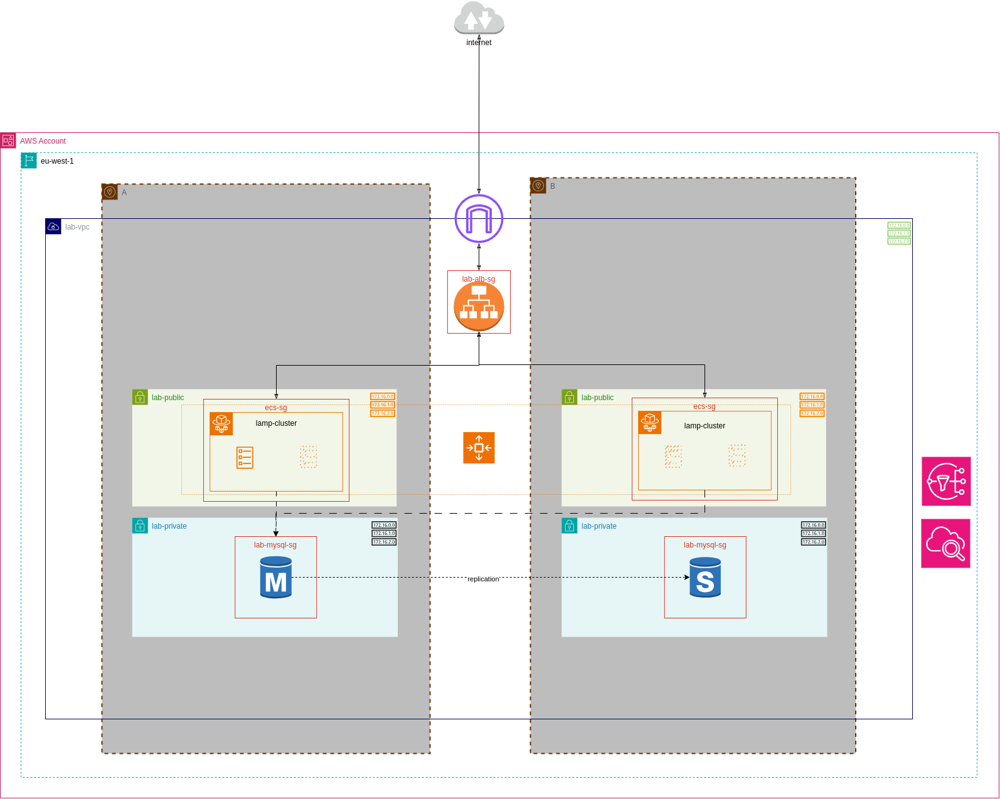
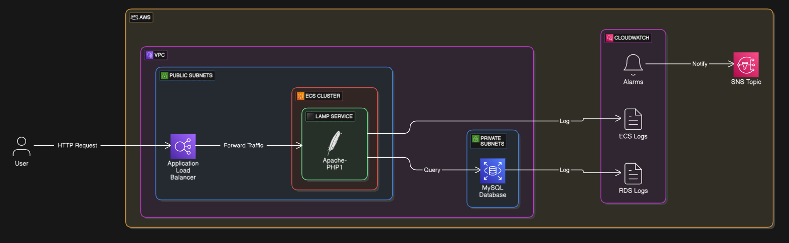

# LAMP Server Deployment on AWS

This project contains Terraform code to deploy a simple LAMP (Linux, Apache, MySQL, PHP) server on AWS.



## Prerequisites

- Terraform installed on your local machine
- AWS account with appropriate permissions
- AWS CLI configured with your credentials
- Docker installed and configured (login) on your local machine
- `jq` installed on your local machine (`sudo apt-get install jq` on Debian/Ubuntu or `brew install jq` on macOS) to run the scripts

## Deployment Steps

1. **Clone and Navigate to the `iac` folder:**

    ```sh
    git clone https://github.com/dansarpong/lamp-lab.git
    cd lamp-lab
    ```

1. **Make the `deploy.sh` script executable:**

    ```sh
    chmod +x deploy.sh
    ```

1. **Modify the environment variables in the `deploy.sh` script:**

    - `AWS_PROFILE`: Your AWS CLI profile name
    - `AWS_REGION`: The AWS region to deploy the resources
    - `EMAIL`: Your email address (for SNS notifications)
    - `DB_USER`: The username for the MySQL database
    - `DB_PASSWORD`: The password for the MySQL database
    - `DB_CREDS_SECRET_NAME`: The name of the AWS Secrets Manager secret to store the database credentials
    - `ECR_NAME`: The name of the ECR repository to store the Docker image

1. **Run the `deploy.sh` script and wait for the deployment to complete:**

    ```sh
    source deploy.sh
    ```

1. **Confirm SNS Subscription:**

    After the deployment is complete, you may receive an email from AWS SNS to confirm your subscription. Click the link in the email to confirm your subscription before you can receive notifications.

## Outputs

After the deployment is complete, Terraform will output the public IP address of the LAMP server. You can use this IP address to access the server via a web browser after a few minutes.

### Requirements for Scalability, Security, and Availability

- Scalability
    1. Autoscaling Group (ASG) scales from 1 to 4 ECS tasks based on Number of requests made to the ALB (scale up at >200, down at <50)
    1. Application Load Balancer distributes traffic across ECS Tasks in multiple Availability Zones
- Security
    1. RDS is in private subnets, not publicly accessible, and encrypted at rest
    1. ECS tasks are in public subnets but restricted via security groups (HTTP limited to ALB).
    1. Database credentials are stored in AWS Secrets Manager
- Availability
    1. RDS uses Multi-AZ for automatic failover
    1. ECS tasks and ALB span two Availability Zones for availability
    1. RDS automated backups retained for 5 days with a daily backup window
    1. ALB performs HTTP health checks on tasks to ensure they are healthy

### Expected Traffic Loads, Performance Needs and Security Levels

- Traffic Loads
    1. Designed for light to moderate traffic (e.g., hundreds of users)
    1. Autoscaling Group can handle increased traffic by adding more tasks
- Performance Needs
    1. 'db.t3.micro' db instances are suitable for light workloads
    1. ALB optimizes request routing to healthy tasks
- Security Levels
    1. RDS is encrypted at rest and not publicly accessible
    1. ECS tasks are secured via security groups
    1. Database credentials are stored in AWS Secrets Manager

### Simple Representation of the Infrastructure



## Cleanup

To destroy the resources, make the `destroy.sh` script executable and run it:

```sh
chmod +x destroy.sh
source destroy.sh
```
