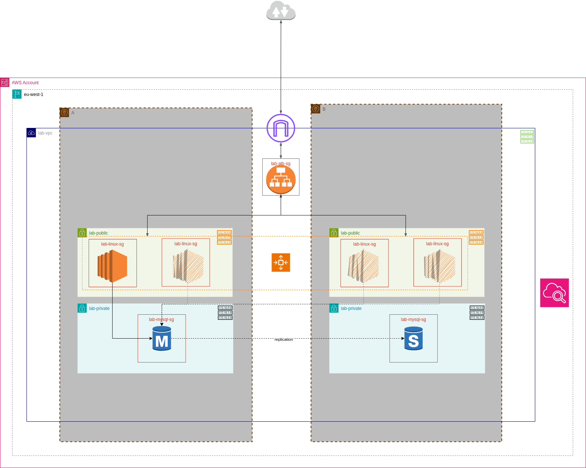

# LAMP Server Deployment on AWS

This project contains Terraform code to deploy a simple LAMP (Linux, Apache, MySQL, PHP) server on AWS.




## Prerequisites

- Terraform installed on your local machine
- AWS account with appropriate permissions
- AWS CLI configured with your credentials

## Deployment Steps

1. **Clone and Navigate to the `iac` folder:**
    ```sh
    git clone https://github.com/dansarpong/lamp-lab.git
    cd lamp-lab
    ```
1. **Set the DB credentials:**
    ```sh
    aws secretsmanager create-secret \
    --profile <profile_name> \
    --name db-creds-v1 \
    --description "Credentials for my LAMP stack DB" \
    --secret-string '{"username": "user", "password": "pass"}' \
    --tags Key=Lab,Value=LAMP
    ```
1. **Initialize Terraform:**
    ```sh
    terraform init
    ```
1. **Set the AWS credentials as environment variables if not already set in default profile:**
    ```sh
    export AWS_PROFILE=<profile_name>
    ```
1. **Plan the deployment:**
    ```sh
    terraform plan
    ```
1. **Apply the deployment:**
    ```sh
    terraform apply
    ```
1. **Confirm the deployment:**
    - Type `yes` when prompted to confirm the deployment.

## Outputs

After the deployment is complete, Terraform will output the public IP address of the LAMP server. You can use this IP address to access the server via a web browser after a few minutes.

## Cleanup

To destroy the resources created by Terraform, run:
```sh
terraform destroy
```

Requirements for Scalability, Security, and Availability
- Scalability
    1. Autoscaling Group (ASG) scales from 1 to 4 t3.micro instances based on CPU utilization (scale up at >70%, down at <30%)
    1. Application Load Balancer distributes traffic across instances in multiple Availability Zones
- Security
    1. RDS is in private subnets, not publicly accessible, and encrypted at rest
    1. EC2 instances are in public subnets but restricted via security groups (SSH limited to EC2 Instance Connect, HTTP limited to ALB).
    1. Database credentials are stored in AWS Secrets Manager
- Availability
    1. RDS uses Multi-AZ for automatic failover
    1. EC2 instances and ALB span two Availability Zones for availability
    1. RDS automated backups retained for 5 days with a daily backup window
    1. ALB performs HTTP health checks on instances to ensure they are healthy


Expected Traffic Loads, Performance Needs and Security Levels
- Traffic Loads
    1. Designed for light to moderate traffic (e.g., hundreds of users)
    1. Autoscaling Group can handle increased traffic by adding more instances
- Performance Needs
    1. 'db.t3.micro' instances are suitable for light workloads
    1. ALB optimizes request routing to healthy instances
- Security Levels
    1. RDS is encrypted at rest and not publicly accessible
    1. EC2 instances are secured via security groups and SSH access is restricted
    1. Database credentials are stored in AWS Secrets Manager
